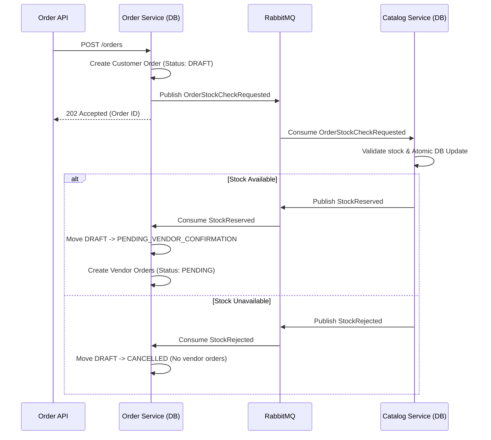

# Architecture Design: CityMarket Order & Stock Validation System

> [!NOTE]
> This document outlines the robust, production-ready architecture for order management, stock reservation, and distributed transaction handling (Saga pattern) across the `order-service` and `catalog-service`.

## 1. Stock Validation Flow (CRITICAL)

### Context & Need for Reservation
To avoid **overselling** in a high-concurrency microservices environment, stock must be temporarily reserved before an order is officially confirmed by vendors. If we only deduct stock upon delivery, a popular product can be ordered by 500 people simultaneously even if only 100 exist in stock. 

The reservation flow implements a **Choreographed Saga**:



### Atomic Reservation Handling
> [!IMPORTANT]
> A critical schema update is needed in `catalog-service`. The table `vendor_products` currently has `reserved_weight_grams` but **lacks** `reserved_quantity`. This must be added.

**Atomic SQL Update**
Concurrency is handled entirely at the database layer using atomic `UPDATE` statements combined with filtering logic. 
```sql
-- Executed inside Catalog Service
UPDATE vendor_products
SET 
  reserved_quantity = reserved_quantity + ?,
  reserved_weight_grams = reserved_weight_grams + ?
WHERE 
  id = ?
  AND is_available = TRUE 
  AND (stock_quantity - reserved_quantity) >= ?
  AND (stock_weight_grams - reserved_weight_grams) >= ?;
```
*If `RowsAffected === 0`, it means stock is insufficient or unavailable, triggering a `StockRejected` event.*

---

## 2. Stock Model

Products operate with either `QUANTITY` or `WEIGHT`. 

### Rules:
- **Available Amount**: 
  - `available_qty = stock_quantity - reserved_quantity`
  - `available_weight = stock_weight_grams - reserved_weight_grams`
- **`is_available` Boolean**: Acts as an override switch AND a hard limit.
  - Automatically flipped to `FALSE` if `available <= 0` during reservation.
  - Can be manually set to `FALSE` by a vendor to disable the product despite stock.

---

## 3. Order Creation Flow

**Option chosen: Option B (Fully Async Saga)**

> [!TIP]
> **Why Async?** 
> Synchronous event-waiting via HTTP blocks resources and creates single-points of failure. Returning `202 Accepted` immediately gives a faster UX, while the client listens via WebSocket or polls for the real state.

**When are orders created?**
1. `customer_order` is created **immediately** on HTTP POST, but in a `DRAFT` or `PENDING_STOCK_CHECK` preliminary state. This persists the user\'s intent.
2. `vendor_orders` are **NOT** created yet.
3. Once `StockReserved` is consumed by `order-service`, the customer order advances to `PENDING_VENDOR_CONFIRMATION` and the `vendor_orders` are generated.

---

## 4. Full Status Lifecycle & Trigger Points

### Customer Order Statuses:
- **`PENDING_VENDOR_CONFIRMATION`**: Reached after stock is reserved. Waiting for vendors.
- **`WAITING_CUSTOMER_DECISION`**: Triggered if *any* vendor sends a proposal (price/weight adjustment).
- **`PREPARING`**: All vendors have accepted (or proposals accepted).
- **`READY`**: All vendors marked their orders as ready for pickup.
- **`PICKED_UP`**: Delivery partner has picked up items from *all* vendors.
- **`IN_DELIVERY`**: Overall order is now en route.
- **`COMPLETED`**: Order reached the customer.
- **`CANCELLED`**: Reached if customer cancels, payment fails, or all vendor orders cancel.

### Vendor Order Statuses:
- **`PENDING`**: Initial state, waiting for the vendor to accept/review.
- **`PROPOSAL_SENT`**: Triggered when a vendor modifies quantities (not enough stock) or adjusts weight, initiating an `order_item_proposal`.
- **`CONFIRMED`**: Vendor accepted the order *or* the customer approved the proposal.
- **`PREPARING`**: Vendor is actively packaging the items. (Can be skipped directly to READY).
- **`PICKED_UP`**: Courier obtained items from this specific vendor.
- **`ON_THE_WAY`**: Courier in transit.
- **`DELIVERED`**: Reached the final destination.
- **`CANCELLED`**: Vendor rejected the order, or customer rejected the proposal.

---

## 5. Relation Between Customer & Vendor Orders

Aggregation rules map Vendor status changes up to the Customer Order:
- `PROPOSAL_SENT` in *any* vendor order → `WAITING_CUSTOMER_DECISION`
- `CONFIRMED` / `PREPARING` in *all* active vendor orders → `PREPARING`
- `READY` (New status implicitly needed if we follow strict flow) or `PICKED_UP` across *all* vendors → `PICKED_UP`
- `DELIVERED` across *all* vendors → `COMPLETED`

> [!WARNING]
> If one vendor cancels their order, the remaining vendor orders proceed. Only if **all** vendor orders are `CANCELLED` does the parent customer order become `CANCELLED`.

---

## 6. Proposals Flow

When a vendor lacks exact quantities or exact weight bounds, they create an `order_item_proposal`.

**Flow:**
1. Vendor inputs proposed quantity/weight.
2. Status transitions: `VendorOrder -> PROPOSAL_SENT`, `CustomerOrder -> WAITING_CUSTOMER_DECISION`.
3. Event `ProposalCreated` fires.
4. **Customer Accepts**: 
   - Update `actual_quantity` = `proposed_quantity` in DB.
   - Catalog stock reservation is **adjusted** (differences released to stock pool via `StockReservationAdjusted` event).
   - VendorOrder -> `CONFIRMED`.
5. **Customer Rejects**: 
   - Proposal `REJECTED`, VendorOrderItem is deleted or marked void. 
   - Stock reservation for that item is fully released.
   - If the VendorOrder reaches 0 items, it becomes `CANCELLED`.

---

## 7. Status Transition Rules

Strict state machine validations prevent bypassing business rules.

```typescript
type CustomerStatus = \'PENDING_VENDOR_CONFIRMATION\' | \'WAITING_CUSTOMER_DECISION\' | \'PREPARING\' | \'READY\' | \'PICKED_UP\' | \'IN_DELIVERY\' | \'COMPLETED\' | \'CANCELLED\';

export function isValidStatusTransitionCustomerOrder(from: CustomerStatus, to: CustomerStatus): boolean {
  const allowedTransitions: Record<CustomerStatus, CustomerStatus[]> = {
    \'PENDING_VENDOR_CONFIRMATION\': [\'PREPARING\', \'WAITING_CUSTOMER_DECISION\', \'CANCELLED\'],
    \'WAITING_CUSTOMER_DECISION\': [\'PREPARING\', \'CANCELLED\'],
    \'PREPARING\': [\'READY\', \'PICKED_UP\', \'CANCELLED\'],
    \'READY\': [\'PICKED_UP\', \'CANCELLED\'],
    \'PICKED_UP\': [\'IN_DELIVERY\'],
    \'IN_DELIVERY\': [\'COMPLETED\'],
    \'COMPLETED\': [],
    \'CANCELLED\': []
  };
  return allowedTransitions[from].includes(to);
}

type VendorStatus = \'PENDING\' | \'PROPOSAL_SENT\' | \'CONFIRMED\' | \'PREPARING\' | \'PICKED_UP\' | \'ON_THE_WAY\' | \'DELIVERED\' | \'CANCELLED\';

export function isValidStatusTransitionVendorOrder(from: VendorStatus, to: VendorStatus): boolean {
  const allowedTransitions: Record<VendorStatus, VendorStatus[]> = {
    \'PENDING\': [\'CONFIRMED\', \'PROPOSAL_SENT\', \'CANCELLED\'],
    \'PROPOSAL_SENT\': [\'CONFIRMED\', \'CANCELLED\'],
    \'CONFIRMED\': [\'PREPARING\', \'PICKED_UP\', \'CANCELLED\'],
    \'PREPARING\': [\'PICKED_UP\', \'CANCELLED\'], // Assuming PREPARING can jump to PICKED_UP
    \'PICKED_UP\': [\'ON_THE_WAY\'],
    \'ON_THE_WAY\': [\'DELIVERED\'],
    \'DELIVERED\': [],
    \'CANCELLED\': []
  };
  return allowedTransitions[from].includes(to);
}
```

---

## 8. Event-Driven System (RabbitMQ)

We use a **Topic Exchange** `citymarket.topic` to allow wildcard routing keys.

| Event | Producer | Consumer | Routing Key | Payload Description |
|---|---|---|---|---|
| `OrderStockCheckRequested` | Order | Catalog | `order.stock.check` | `{ orderId, items: [{ productId, qty, weight }] }` |
| `StockReserved` | Catalog | Order | `catalog.stock.reserved` | `{ orderId }` |
| `StockRejected` | Catalog | Order | `catalog.stock.rejected` | `{ orderId, reason }` |
| `VendorOrderCreated` | Order | Notification | `order.vendor.created`| `{ vendorOrderId, vendorId }` |
| `ProposalCreated` | Order | Notification/Push | `order.proposal.created`| `{ proposalId, customerId }` |
| `CustomerDecisionMade` | Order | Catalog | `order.decision.made` | `{ orderId, accepted: boolean, adjustments: [] }` |
| `OrderPickedUp` | Delivery | Order | `delivery.order.picked_up`| `{ vendorOrderId, courierId }` |
| `OrderDelivered` | Delivery | Catalog/Order| `delivery.order.delivered`| `{ vendorOrderId, items: [...] }` |

**Resilience & Reliability:**
- **Retry Strategy**: Implement a Delayed Message Exchange plug-in or TTL-based retry queues (e.g., `q.order.retry.10s`, `1m`, `5m`).
- **DLQ**: Messages failing >3 times move to a Dead Letter Queue (`q.dlx.failures`) for admin review.
- **Idempotency**: Every consumer uses a Redis or DB table `consumed_events (event_id, consumer_name)` to prevent double processing of RabbitMQ messages.

---

## 9. UI Requirement for Out-Of-Stock Products

When `is_available === false` or `(stock - reserved) <= 0`:
- **Backend sync**: Use WebSockets (Socket.IO) to push a `PRODUCT_AVAILABILITY_CHANGED` event to all active clients viewing that vendor\'s store.
- **Frontend Reaction**: Zustand stores listen for the event. The UI conditionally wraps the Product Card in a visual disable state.

**React Native Implementation:**
```tsx
const ProductCard = ({ product }) => {
  const isAvailable = product.is_available && (product.stock_quantity - product.reserved_quantity > 0);

  return (
    <View style={[styles.card, !isAvailable && styles.disabledCard]}>
      <Image 
        source={{ uri: product.image_url }} 
        style={[styles.image, !isAvailable && styles.blurredImage]} 
      />
      {!isAvailable && (
        <View style={styles.overlay}>
          <Text style={styles.outOfStockText}>Out of Stock</Text>
        </View>
      )}
      {/* Product Details ... */}
    </View>
  );
};

const styles = StyleSheet.create({
  disabledCard: { opacity: 0.6 },
  blurredImage: { tintColor: \'gray\' }, // Or use @react-native-community/blur
  overlay: { position: \'absolute\', zIndex: 2, alignItems: \'center\', justifyContent: \'center\' }
});
```

---

## 10. Consistency Rules
1. **Completion Barrier**: The Customer Order `sync()` function MUST loop through all parent `vendor_orders`. `customer_order` state ONLY enters `COMPLETED` when `vendors.every(v => v.status === \'DELIVERED\' || v.status === \'CANCELLED\')` and at least one is DELIVERED.
2. **Delivery Barrier**: `vendor_order` CANNOT move to `ON_THE_WAY` unless its previous state was `PICKED_UP`.
3. **Proposal Resolution**: An order CANNOT proceed to `PREPARING` if any open `order_item_proposals` exist with status `PENDING`.

---

## 11. Edge Cases Handled

1. **Service Downtime**: If `catalog-service` is down, `OrderStockCheckRequested` queues up in RabbitMQ. The customer sees "Order processing" until it comes back online.
2. **Partial Stock Failure**: Depending on business rules, if 1 item fails, reject the entire cart. Inform customer at checkout: "Item X is sold out".
3. **Duplicate Events**: Handled via Idempotency keys (`event_id`).
4. **Race Conditions in DB**: Two users buying the last milk. The SQL Atomic Update dictates one will succeed (RowsAffected = 1) and the other will fail immediately (RowsAffected = 0).

---

## 12. Implementation Plan

1. **Database Migrations**
   - Alter `catalog-service` schema: Add `reserved_quantity` to `vendor_products`.
   - Add `DRAFT` status to `customer_orders`.
2. **RabbitMQ Infrastructure**
   - Create topics, queues, DLQs, and attach to services.
3. **Order Service - Saga Orchestrator**
   - Update `POST /orders` to create DRAFT and emit event.
   - Implement `StockReserved` and `StockRejected` consumers.
4. **Catalog Service - Stock Controller**
   - Implement consumer for `OrderStockCheckRequested`.
   - Write SQL transaction for atomic increments.
5. **Proposals & Adjustments**
   - Connect the proposal accept/reject logic in `order-service` to emit adjust events to `catalog-service`.
6. **Delivery Deductions**
   - Make sure `catalog-service` consumes `OrderDelivered` to subtract `stock` AND subtract `reserved` permanently.
7. **Frontend State Updates**
   - Hook up WebSocket events for `is_available` toggles in mobile applications.

---

## 13. Bonus Architectural Recommendations

- **Outbox Pattern**: Instead of calling `rabbitmq.publish()` immediately after `db.save()`, which risks the DB saving and RabbitMQ failing, insert the event into an `outbox_events` table in the same DB transaction. A separate chron/worker reads the outbox table and publishes to RabbitMQ reliably.
- **Saga Orchestrator state**: Create a `saga_states` table in `order-service` (`id, order_id, correlation_id, step, status`) to centrally track where the order is in the distributed flow (Checking Stock -> Creating Payment -> Confirming Vendor).
- **Monitoring**: Add OpenTelemetry tracing headers to RabbitMQ messages so you can visualize the entire lifecycle (HTTP -> Order Service -> RMQ -> Catalog Service) in Jaeger or DataDog.

## Verification Plan

Because these are deep architectural changes, the implementation requires building specific technical features. 
**Testing the flow functionally**:
1. Seed the DB with a product (Qty = 1).
2. Use k6/Artillery to fire 50 concurrent `POST /orders` for that product.
3. Validate that exactly 1 order becomes `PENDING_VENDOR_CONFIRMATION` and 49 become `CANCELLED`.
4. Validate `reserved_quantity` is exactly 1 in `catalog-service`.
